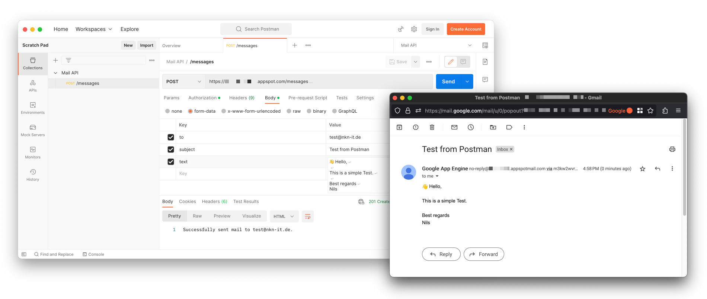

# Google App Engine Mail API

[](https://github.com/Cyclenerd/google-cloud-appengine-mail-api#readme)
[](https://github.com/Cyclenerd/google-cloud-appengine-mail-api#readme)
[](https://github.com/Cyclenerd/google-cloud-appengine-mail-api#readme)
[](https://github.com/Cyclenerd/google-cloud-appengine-mail-api/actions/workflows/ci.yml)
[](https://github.com/Cyclenerd/google-cloud-appengine-mail-api/blob/master/LICENSE)

Create your own Mail API based on Google App Engine (GAE).

This Mail API make integrating email into your existing applications easy with your own RESTful API.
It is developed in Python 3 and uses the Google App Engine API for legacy bundled services.

Make API calls to emails:




## 🏃 Deploying

1. Clone this repo
    ```bash
    git clone https://github.com/Cyclenerd/google-cloud-appengine-mail-api.git
    cd google-cloud-appengine-mail-api
1. Deploy app to App Engine
    ```bash
    gcloud config set project PROJECT_ID
    gcloud app deploy
    ```
1. Create new Google Cloud Secret Manager secret
    ```bash
    gcloud auth application-default login
    terraform init
    terraform apply
    ````
1. Generate and store API password *(without newline)*
    ```bash
    openssl rand -hex 25 | tr -d \\n | gcloud secrets versions add "api-password" \
        --data-file=-
    ```
1. Access API password
    ```bash
    gcloud secrets versions access latest --secret="api-password"
    ```

Optional:
You can set the mail sender (email address for From header) with the environment variable `SENDER` in [app.yaml](./app.yaml).
Default sender is `[PROJECT_ID] <no-reply@[PROJECT_ID].appspotmail.com>`.


## 🔑 Authentication

Authentication to the Mail API is done by providing an Authorization header using HTTP Basic Auth; use `api` as the username and your secret API password as the password.

Here is how you use basic HTTP auth with curl:

```bash
curl --user 'api:YOUR_API_PASSWORD'
```

> **Warning**
> Keep your API password secret! 


## 🆗 Status codes

The Mail API returns standard HTTP response codes.

| Code | Description                                      |
|------|--------------------------------------------------|
| 201  | Everything worked as expected                    |
| 401  | Unauthorized - No valid API password provided    |
| 400  | Bad Request - Often missing a required parameter |


## 📨 Sending

```text
POST https://PROJECT_ID.REGION_ID.r.appspot.com/messages
```

| Parameter | Description |
|-----------|-------------|
| to        | Email address of the recipient(s). Example: "Bob <bob@host.com>". You can use commas to separate multiple recipients. |
| subject   | Message subject | 
| text      | Body of the message. (text version) |

[](https://god.gw.postman.com/run-collection/27209799-10be5b51-0e87-40b6-b296-3f6e5171b065?action=collection%2Ffork&collection-url=entityId%3D27209799-10be5b51-0e87-40b6-b296-3f6e5171b065%26entityType%3Dcollection%26workspaceId%3D2f69452f-4a42-4034-9954-d1d38e17ef0a)

### Example

Sending a plain text message:

```bash
curl -s --user "api:YOUR_API_PASSWORD" \
    "https://PROJECT_ID.REGION_ID.r.appspot.com/messages"
    -F "to=test@nkn-it.de" \
    -F "subject=Test" \
    -F "text=Test"
```

Sample response:

HTTP code: `201`

```text
Successfully sent mail to test@nkn-it.de.
```

👉 **[More examples (Go, PHP, Perl, Python, Ruby...)](./examples/)**


## 🆘 Error codes

This is a list of possible return codes and messages from the `/messages` endpoint.

| Code | Error message                        |
|------|--------------------------------------|
| 400  | `to` parameter is missing            |
| 400  | `subject` parameter is missing       |
| 400  | `text` parameter is missing          |
| 401  | Forbidden (Unauthorized access)      |
| 405  | Method not allowed (please use POST) |
| 500  | Internal Server Error                |


## 💡 Rate Limits

The default quota for email recipients is 100 per day.
If you need a higher mail quota, you can use SendGrid or Mailgun to send email.


## 📚 Read more

* [Sending mail with the Mail API](https://cloud.google.com/appengine/docs/standard/services/mail/sending-mail-with-mail-api)
* [Flask app to access bundled Mail services API in Python 3](
https://github.com/GoogleCloudPlatform/python-docs-samples/tree/main/appengine/standard_python3/bundled-services/mail/flask)


## ❤️ Contributing

Have a patch that will benefit this project?
Awesome! Follow these steps to have it accepted.

1. Please read [how to contribute](CONTRIBUTING.md).
1. Fork this Git repository and make your changes.
1. Create a Pull Request.
1. Incorporate review feedback to your changes.
1. Accepted!


## 📜 License

All files in this repository are under the [Apache License, Version 2.0](LICENSE) unless noted otherwise.

Portions of this repository are modifications based on work created and shared by [Google](https://developers.google.com/readme/policies)
and used according to terms described in the [Creative Commons 4.0 Attribution License](https://creativecommons.org/licenses/by/4.0/).